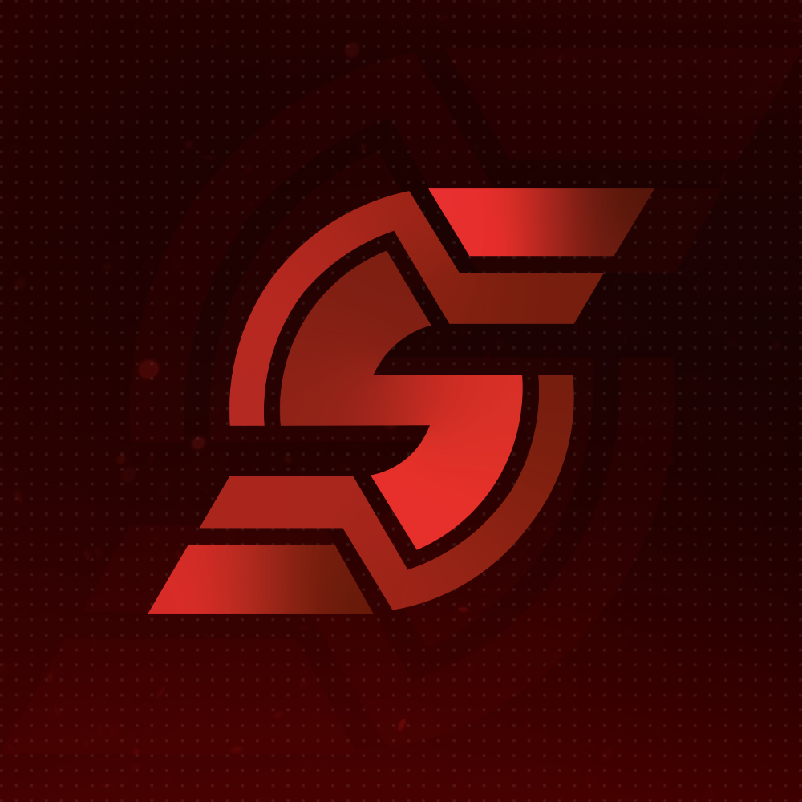

<p align="center">
  
</p>

<h1 align="center">NFA Loader</h1>

<p align="center">A fast, private Windows loader for switching between Steam accounts with login tokens.<br/>Built for <a href="https://shefu223.shop">shefu223.shop</a>, works with any valid Steam login token.</p>

---

Paste a token, press Add, and the loader writes the account straight into Steam's own files so you can sign in with one click. No password, no Steam Guard prompt, just the token. Every account check runs locally on your PC. Nothing about your accounts is sent to the shop and no proxies are used.

## Features

- One click login and re-login between saved accounts
- Add accounts in the `username----token` format
- **Token valid or invalid** shown on every card, checked locally
- **CS2 rank on the card**: Premier rating, Wingman rank, and competitive cooldown
- Profile picture, display name, and online status pulled from the public profile
- Optional VAC status and Steam level (needs a free Steam Web API key)
- Inventory value on demand
- **View token** button that shows the full line you pasted, with a copy button
- Live warranty countdown for accounts bought from shefu223.shop
- Rename, remove, clear Steam data, or wipe the whole list
- Automatic update notice when a newer build is out
- Runs as Administrator so it can write Steam's files reliably

## Requirements

- Windows 10 or 11
- Steam installed, and signed into any account at least once (the loader needs Steam's config files to exist)
- Administrator rights (the loader asks to elevate on launch)

## Getting started

1. Download the latest `nfa.exe` from the [Releases page](https://github.com/shefu223/nfa-tool/releases/latest).
2. Run it and approve the Administrator prompt.
3. Paste a line in the `username----token` format and press Add.
4. Press Log In on the account you want. Steam restarts and signs in on its own.

## The token format

Each account is one line:

```
username----token
```

The username is the label shown on the card. The token is the Steam login token that actually signs you in. The loader reads the SteamID out of the token, so a bad token is rejected before it is ever saved.

## How the checks work

Everything runs on your machine. No shop service, no proxies.

- **Token valid or invalid.** The loader does a quiet Steam login with the account's own token, the same kind of login the Steam client does when it starts. If the token is dead you see a red "Token invalid". If Steam cannot be reached it stays neutral and says it could not check, it never guesses.
- **Premier rating, Wingman rank, cooldown.** Read from the account's own CS2 matchmaking page during that same quiet login.
- **Profile picture, name, online status.** Read from the public Steam profile.
- **VAC status and Steam level.** Optional. Add a free Steam Web API key in Settings and these fill in too.
- **Inventory value.** Checked on demand from the detail window.

Checks are cached, so opening the loader is instant and it does not re-check everything every time. If Steam starts rate limiting your connection the loader pauses the heavy checks and tells you to try again later.

### A note on medals and CS2 level

True in game medals and the in game CS2 profile level can only be read by fully launching CS2, which would sign the account into the game. To keep the check quiet and safe the loader does not do that. Instead it shows the real Premier and Wingman rank art, which is the standard for this kind of tool.

## Optional: Steam Web API key

VAC status and Steam level use Steam's public Web API, which needs a free key. Get one at [steamcommunity.com/dev/apikey](https://steamcommunity.com/dev/apikey), then paste it into Settings inside the loader. The key stays on your PC. Everything else works without it.

## Warranty

Warranty is synced with shefu223.shop. Accounts bought from the shop show a live countdown. Tokens that did not come from the shop simply show "No warranty", which is expected.

## Privacy and safety

- Account checks are local. No proxies, no shop API for account data.
- The login used for checking reuses the token Steam already granted, so it does not rotate your token and does not send a "new login" email.
- The released `nfa.exe` is built with the developer's Windows username and machine paths scrubbed out.

## Building from source

Needs Rust (stable MSVC toolchain, 1.88 or newer) and the Visual Studio Build Tools.

```powershell
.\build.ps1
```

This builds a fully self contained `nfa.exe` (static C runtime) and scrubs local paths and the Windows username from the binary. The only runtime requirement is the WebView2 runtime, which ships with Windows 10 and 11.

## Updates

The loader checks [`latest.json`](latest.json) on launch and shows a notice when a newer version is out.
