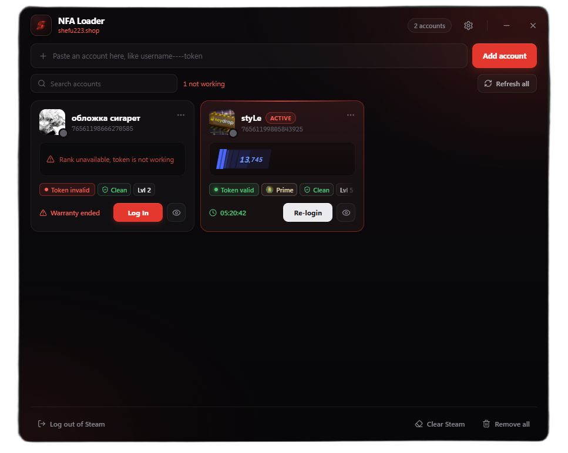

# NFA Loader

Windows loader for switching between Steam accounts using login tokens. Built for shefu223.shop, works with any valid Steam login token.



Paste a token, press Add, and the loader writes the account into Steam's config so you can sign in with one click. Account checks (token valid or invalid, CS2 Premier and Wingman rank, cooldown, avatar, and with an optional Steam Web API key VAC status and level) run locally on the machine. No proxies, no external checker service.

## Build

Requires the Rust stable MSVC toolchain and the Visual Studio Build Tools.

```
.\build.ps1
```

This produces a self-contained `nfa.exe` (static C runtime) and scrubs local build paths and the Windows username from the binary. WebView2 is the only runtime dependency and ships with Windows 10 and 11.

## Layout

- `src/main.rs` Tauri backend: account storage, Steam config writing, login flow
- `src/steam_check.rs` local checks: token validity, CS2 rank scrape, profile, bans, inventory
- `ui/` frontend (HTML, CSS, JS) embedded into the binary at build time
- `icons/`, `assets/` app icons and brand art
- `tauri.conf.json`, `capabilities/` Tauri window and permission config
- `build.ps1` release build with path and username scrubbing
